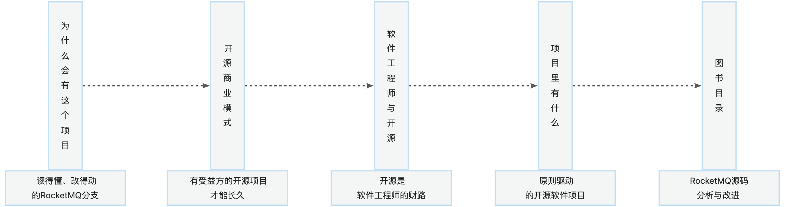
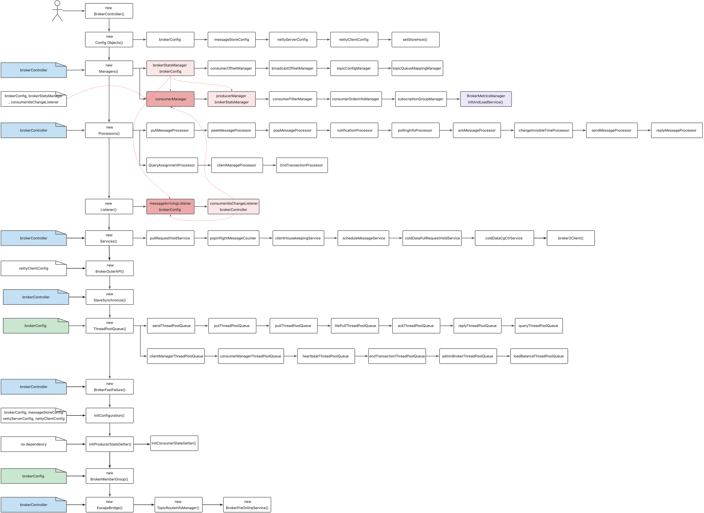
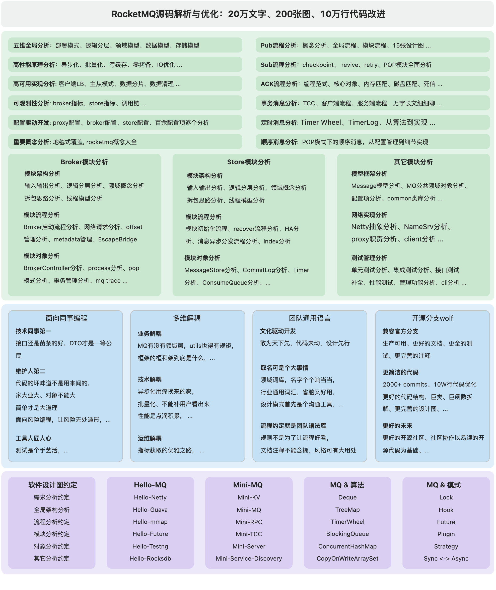

<h2 id="HOJbP">为什么做一个新的分支?</h2>
先说结论: 我们也是被逼着成长的。


<h3 id="KVJyy">官方分支的难处</h3>
大家试想，如下两件相加会发生什么：

+ 码龄超过10年的大型软件项目
+ 在双十一大旗下，『稳』字有重

备注：原团队已在开发新的代码分支

[https://github.com/AutoMQ/automq-for-rocketmq](https://github.com/AutoMQ/automq-for-rocketmq)

<h3 id="gyZGG">Wolf分支的初心</h3>
我们是一个做交易、支付系统的小团队：

+ 需要RocketMQ, , 交易支付类事务消息，RocketMQ目前是唯一的选择
+ 需要阿里云之外使用用RocketMQ

源于以上两点，我们需要**源码级掌握RocketMQ**,  
这个便是这个分支的原点。

<h3 id="UApfl">读得懂的分支</h3>
**分支现在的状况：**

+ 生产在用，支撑着500万+订单/天的支付系统
+ 约10W+代码优化，主要是代码可读性上的优化
+ 3人小组，8个月代码阅读与文档记录

wolf代码仓库：[https://github.com/wolforest/rocketmq](https://github.com/wolforest/rocketmq)

关于rocketmq的小伙伴，劳驾给个star.


对于我们而言，读懂RocketMQ源码，是别无选择。

没法和老板们去解释，搞不定XXX是没搞定MQ的原因

对于我们而言，  
读得懂，才能有下文；   
改得动，才算真掌控；

<h2 id="Obw55">这个分支有什么？</h2>
<h3 id="Ypmtk">易读的代码</h3>
<h4 id="YIGJV">面向同事编程</h4>
<<面向同事编程>>是我们团队斗胆尝试的，一本关于编程原则的书。

内容不多说，核心是：我们相信，代码是写给同事的，代码的客户就是我们的同事。


对于希望做出长命百岁软件的团队，我们写的代码，总有一天会交给别人来维护。

减少同事口中 WTF 的数量就是我们的节操。


回到wolf分支，我们就是需要服务的客户，我们需要读懂代码。

我们便按这个能读懂的方向，推进了大半年。

<h4 id="Lp2V4">分拆长函数，分解大对象</h4>
一个对象，3000行 + 125个依赖对象

一个方法，500行 + 异步回调 + 12层代码嵌套

对于我们来说确实是巨大的挑战，我们硬着头皮：拆


一个文件拆到10个文件

一个函数拆到10个函数

所有的回调拆成函数

拆了多半年，相信代码好读多了，不过路依然很长，RocketMQ是个不算小的工程

<h4 id="Fha0U">改个能听得懂的名字</h4>
RocketMQ有些名字，确实是看完十多遍代码，外加小组讨论后，才能大概知道这个概念的大概意思。

另外还有一些过简的简写，我们做了一些改名，并用 注解 renamed标注了所有的命名变更

下面为部分更名记录

```java
/**
 * @renamed from addCk to addCheckPoint
 * @renamed from addCkJustOffset to storeCheckPoint
 * @renamed from needDiscard to isOverMaxCheckTimes
 * @renamed from brokerOutApi to ClusterClient
 * @renamed from checkQueueOk to isQueueFull
 */
```

<h3 id="jtcIq">更全的文档</h3>
<h4 id="jQ8CI">配置项需要文档</h4>
先来看一张模糊的图，这个是rocketMQ的所有配置项


不多说了，相信这张图，一定能呼唤出对文档的需求

<h4 id="hDmd6">代码逻辑也需要文档</h4>
再来一张我们做大类切分时候画的一张图

我们把BrokerController依赖的125个对象关系梳理成了一张图

相信没有这张图，谁也不敢把这个3000行的大类给拆了。



<h4 id="O9IDJ">一图胜千言，真的</h4>
当然一张图是远不够的，需要有各种维度的图...

我们画了200+的图，为了让自己理解，也为了让兄弟们一起理解。

希望这些图对大家也能有点帮助。

<h3 id="eFLax">更多的请看代码</h3>
我们也在代码结构上做了一些变更，相信有些变更，大家会有熟悉的感觉。

我们尝试把DDD的命名方式引入到了分支中，好不好呢？大家看过再评。


另外我们在代码上加上了大量的注释，相信能有一定的帮助。

<h2 id="nzuiD">源于开源，回归开源</h2>
<h3 id="Xa7Wf">我们是开源的受益方</h3>
<h4 id="P8Zpb">开源解决了我们的痛</h4>
这一点比较容易理解，读源码再难，也和实现一个MQ的难不在一个量级上

感谢前人载的树，我们希望我们在代码风格上的一点点优化，最后能够回归社区。

<h4 id="faVrr">开源中学『真并发』</h4>
后端的工程师大都喜欢高并发的环境，而RocketMQ在高并发领域，确实值得称道。

它不仅解决了阿里双十一的高峰，相信也是国内很多电商的基石。

学习一下MQ的设计绝对会让所有人受益匪浅。


另外从我们的视角，RocketMQ除了是高并发交易的唯一选择

还是最简单，最易学的高性能消息队列。


再多说一点，在云已统一世间的时代，很多的复杂的分布式算法，已是基础设施

MQ这一层其实是可以无须实现，而砍掉这些复杂的功能特性后，MQ可以易用、好用、也够用。

<h3 id="iajrk">希望更多人参与开源</h3>
<h4 id="nvHNF">开源是职业台阶</h4>
相比得到老板的认可而言，得到同行的认可容易更多。

正如有个同事说的："最危险的技术工作是 CTO"

这句话，做过CTO的一定能懂。


说点正向的，得到更多同行的认可，

逐步建立自己的技术影响力是拓宽职业道路的重要手段。

<h4 id="iBlXD">开源是学习平台</h4>
在互联网热的时候，行业只管效率，不顾成本的发展

除了造就了今天的『内卷』，还造就了大量的CRUD工程师。

我们也提个小建议，参与开源，比刷算法，性价比要高很多。

很多开源项目中是真实的场景，真实的问题，参与能学到真实的能力。

<h3 id="ODPfJ">左手代码，右手写本书吧</h3>
<h4 id="lK8kA">文档、代码不分家</h4>
国内的工程师写文档少，这确实是事实，无可辩驳。

这个是时势造就，行业热的时候，老板们只会关心，什么时候上线。

如果你的技术影响到了进度，后果可想而知。


感谢内卷的时代，内卷会让老板们知道，软件质量的价值。

老板们关注质量，行业都会回到质量优先。

而文档就是用来协作的，再过几年，相信不会有人再说中国人不写文档了。

<h4 id="spzX8">工程师是天生的作家</h4>
工程师天生会写文档，不过好坏真不能另说。

写作是工程师必须练习的一项技能，这个类似英语能力。

这个会逐渐成行行业的『潜规则』。

<h4 id="jI9fC">RocketMQ源码分析与改进</h4>
《RocketMQ源码分析与改进》就是我们这大半年学习沉淀的产出，也希望这本小书能对大家有所帮助，

下面是这本书的目录，大家轻拍哈。



