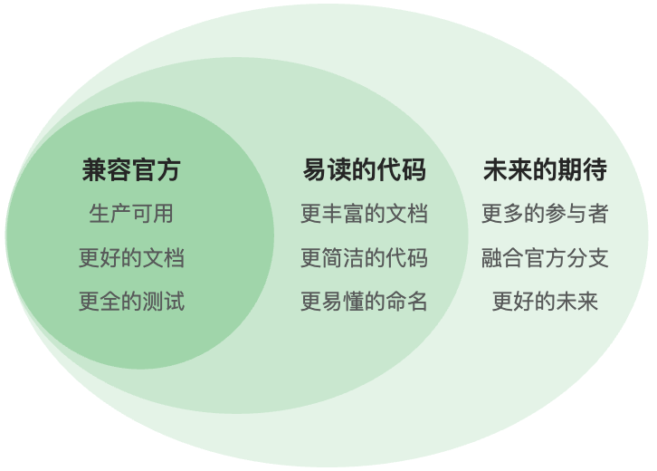

## 本文内容逻辑图

## Why another RocketMQ branch?
### 官方分支的难处
大家试想，如下两件相加会发生什么：
* 码龄超过10年的大型软件项目
* 在双十一大旗下，『稳』字有重

### 新分支的初心
我们是一个做交易、支付系统的小团队：
* 需要RocketMQ的助力
* 需要阿里云之外使用用RocketMQ

源于以上两点，我们需要源码级掌握RocketMQ,
这个便是这个分支的初心。

### 读得懂、改得动的分支
源码参与者的视角，代码质量的重要性无需多言。 
读得懂，才能有下文；  
改得动，才算真掌控；  

## 开源
### 开源商业模式
不符合经济学原理的事物，大概率都无法长久。  
开源也不例外，自然是利益相关方推动的结果。

### 开源收益方
可能的开源收益方：
* 科技企业：品牌、招聘
* 软件工程师：协作学习，扬名立万。
* 使用软件的人：更低的价格，更好的品质

### 开源价值观
* 开放协作
* 共同进步

开源不等同于免费，开源的本质目的在于共同进步。 
而进步证书这种求名而后换利的方式，也算是站着把钱赚了。

## 软件工程师与开源
### 码在人在
你可想编码到最后一天？  
假如不差钱，你可想编码到最后一天？ 
相信不差钱的话，大多数软件工程师都愿意。 

### 代码阶梯
写代码的难，最难的估计是如下几个:  
* 担心挣不到钱
* 担心挣不够钱
* 担心挣钱不久

### 开源之路
开源是软件工程师的财路，无须多言，知者自知。

## 这里有什么？
### 更好的代码
好的代码是设计出来的。设计是基于原则的。 
原则驱动是软件开发『道』。

#### 面向同事编程
大型软件系统，软件工程师开发的代码，总有一天需要交给别人来维护。 
写出同事能读的懂的代码，是工程师的节操。
#### 多维解耦
『解耦』是软件工程师最熟悉的工具，但熟悉并不代表已掌握。 
解耦技能需要终身磨砺。
#### 沉淀文化，虚事实做
优秀的团队都是使命驱动，文化保障的。 
文化是团队成员的行为指南，软件工程需要无数细节堆砌,  
构建强有力的团队文化，必不可少。

### 更全的文档
#### 无名天地之始，有名万物之母
命名，不仅是软件工程师的挑战，是所有人类面临的挑战。 
概念是人类沟通的基础，清晰的命名，明确的概念定义，难却无法避免。  
而构建对应的文档，是一种有效的方法。
#### 一图胜千言，千图道自名
图示是语言的补充，适量的图示是文档必不可少的组全部分
#### 文不在多，简洁为美 
文档同代码一样，不能为了文档而写文档。 
达意是文档的目标，脱离这个目标的文档，都是耍流氓。

### 更好的社区
完美的社区是从没有社区开始的。 
没有使命的企业难成大业，没有灵魂的社区注定不会开花.  

## 《RocketMQ源码分析与改进》图书目录

